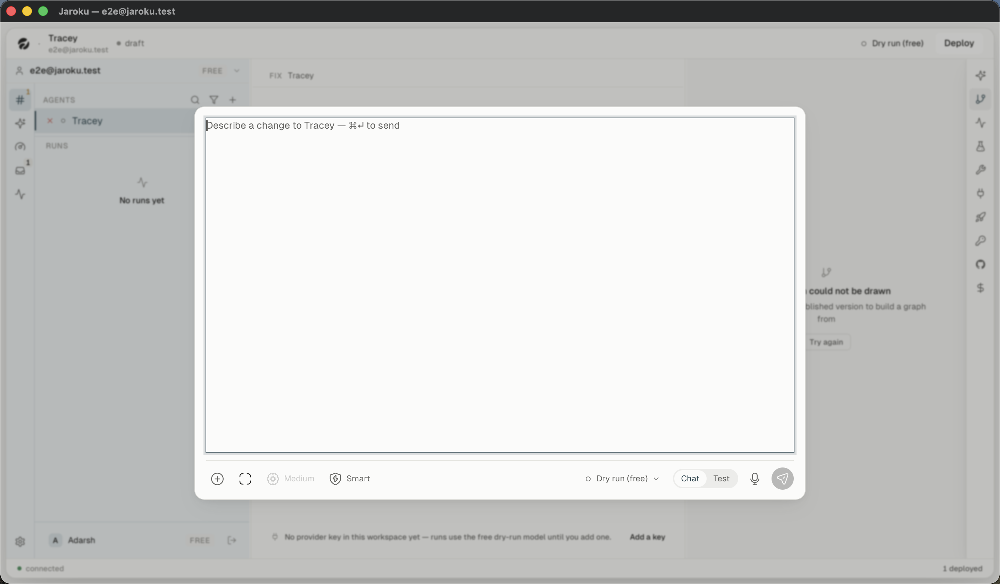
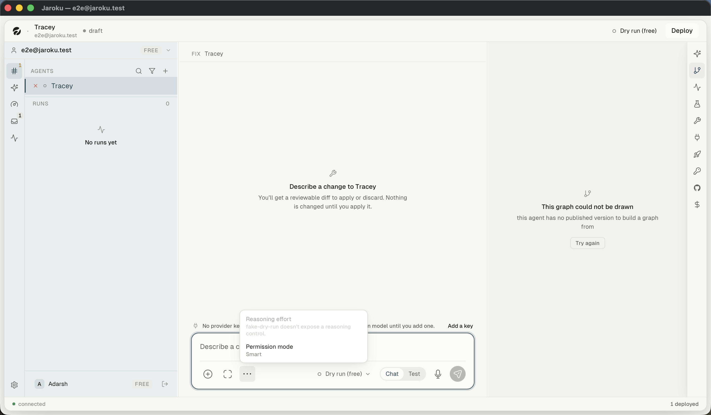

# Components — inputs

## The composer — one component, three variants

The single most important interactive surface in the product, and it wears three different control
bars depending on what it is for.

| | Build | **Operate** | **Dispatch (Cockpit)** |
|---|---|---|---|
| Source | `BuildPane.tsx` + `components/composer/` | same component, `mode === "operate"` | `WorkComposer.tsx` — **a different component** |
| `⊕` attach | ✓ | ✓ | ✗ |
| Expand ⛶ | ✓ | ✓ | ✗ |
| `⋯` settings | ✓ | ✓ | ✗ |
| Model picker | ✓ | ✗ | ✗ |
| `Chat \| Test` | ✓ | ✗ | ✗ |
| Microphone | ✓ | ✓ | ✗ |
| Send | ✓ | ✓ | ✓ |
| Intent label | — | `This reads the record` / `This will run X` | `<agent> — will run for real` |
| Gate before sending | ✗ | ✓ on a command | ✓ always |

⚠ Three composers, three control bars, two components. The Cockpit's is the plainest and the most
consequential.

### The control bar's floor

The bar is a row of fixed hit targets that may not wrap. A **percentage** floor put the mic and the
send button outside the composer's own box at 1440px, so the column takes a **measured pixel** floor
instead (`lib/paneFloor.ts`, commit `0a72323`). A related fix: the composer's model label is prose
in a row that may not wrap, so a narrow pane drew it one character per line and pushed send off the
bar (`fd0015d`).

### Expanded composer

⛶ opens a large modal composer. Its control bar **differs from the compact one**: `Medium`
(reasoning effort) and `Smart` (permission mode) appear as **inline chips**, where the compact bar
hides both behind `⋯`. ⚠ Same two settings, two presentations.

### The `⋯` settings popover

Two rows. Disabled entries state their reason rather than greying silently:

> **Reasoning effort** — *fake-dry-run doesn't expose a reasoning control.*
> **Permission mode** — Smart

### The `⊕` attach popover — empty state

> **Nothing to attach yet**
> Generate an agent, run it, or link it to GitHub — then its files, runs and commits can be
> referenced from here.

Bound to `⌘/` at the window from `BuildPane` — deliberately **one** owner, because *"a chord with
two owners is a chord whose behaviour depends on which listener ran first."*

### Send

`⌘↵` everywhere. The placeholder states the chord — `— ⌘↵ to send` — in both thread composers.

### Voice

`VoiceWaveform.tsx` + `lib/useVoiceInput.ts`. Present on both thread composers, absent from the
Cockpit's. `IMPLEMENTED / NOT CURRENTLY OBSERVABLE`.

## Fields

| Component | Used by |
|---|---|
| plain text input | sign-in, secrets passcode, connector credentials, workspace name |
| `Select.tsx` | member roles, agent sort, reasoning effort |
| `Checkbox.tsx` | marketing opt-in, filter groups |
| `ChoiceRow.tsx` | onboarding choices, permission modes |
| filter field | Threads (`/`), Agents (`search agents…`) — **not** the Cockpit |

## Focus

One `FOCUS_RING` value for every focusable thing: `0 0 0 1px <accent>, 0 0 0 4px <accent 16%>`.
It is the interaction accent because a focus ring is one of the four sanctioned uses of it — see
[`../legacy/design-arguments.md`](../legacy/design-arguments.md).
