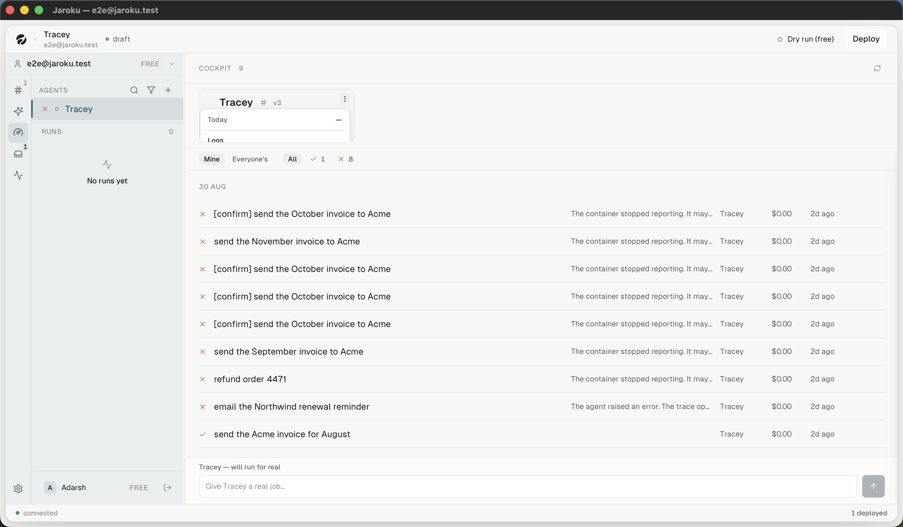
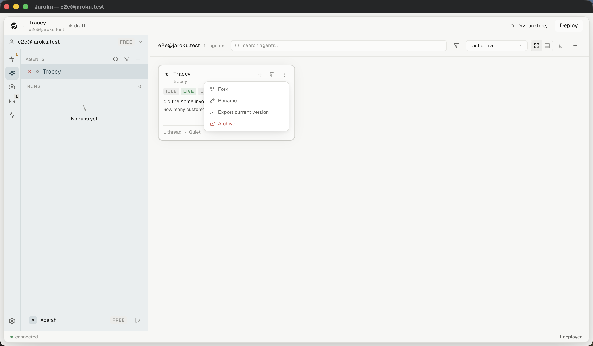
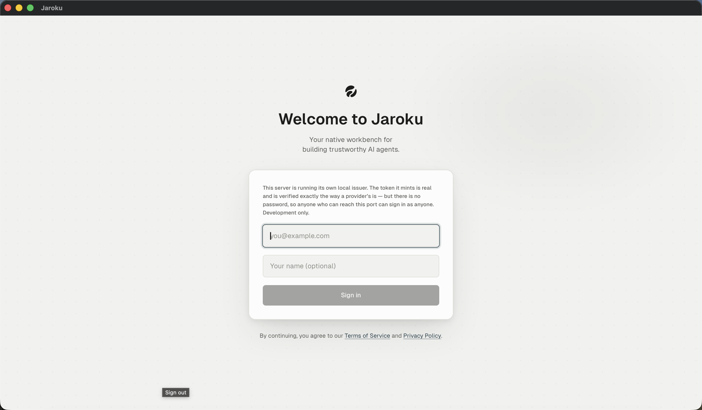

# Findings — inconsistencies

Redesign inputs. **Nothing here was fixed.** Each entry names what was observed, where, and the
evidence.

---

## 1. ⚠⚠ The same overflow-menu pattern, implemented twice, one of it invisible

| | Agents board card | **Cockpit fleet card** |
|---|---|---|
| Trigger | `⋮` on a card | `⋮` on a card |
| Menu | floating list | floating list |
| Renders | **outside the card, correctly** | **clipped inside it** |

The fleet card root is `overflow-hidden` (`FleetStrip.tsx:306`), the menu is a descendant of it
(`:136`), and it opens `top-full` (`:155`). The strip track is a second clipping ancestor (`:538`).
`z-30` cannot escape either.

**Consequence: `Logs`, `Reconnect` and `Kill` cannot be read or clicked**, and runtime logs have no
other route in the product.

---

## 2. ⚠⚠ Two surfaces disagree about the same agent's version and history

For **Tracey**, which has a live Railway deployment and nine dispatched jobs:

| Surface | Version | Runs |
|---|---|---|
| Cockpit fleet card | **v3** | 9 in the header |
| Pre-flight gate | **v3** | — |
| Work detail | **v3** | — |
| Deploy panel | **v3** (`live for 2d 19h`) | — |
| Activity → RELEASES | **v3** | — |
| **Agent detail** | **v1** | **0** — *"Nothing has run yet."* |

Five surfaces say v3. One says v1.

Both are literally true and they read different tables: `agents.current_version = 1`,
`deployments.version = 3`; `runs` is empty for this workspace while `work_items` holds nine. The
problem is the **labels**: agent detail's field is called **LIVE VERSION**, which is the
deployment's fact, and **RUNS, 7 DAYS: 0** is said on the profile of an agent that ran nine jobs
this week.

Agent detail also states *"Nothing has been published for this agent yet"* and *"Nothing has been
published, so nothing has been validated"* on an agent that is in production.

---

## 3. ⚠ Two names for one surface

| Label | Where |
|---|---|
| **GitHub** | the right-panel tab (`RightPanel.tsx:79`) |
| **Integrations** | the Workspace panel card that opens that exact tab (`WorkspacePanel.tsx:252`) |

---

## 4. ⚠ A gear that is not settings, and a popover 1300px from its trigger

The icon at the foot of the rail is a **gear** — the universal settings glyph. It opens **Provider
keys** (`Sidebar.tsx:457`, `title="Provider keys"`).

The popover it opens is anchored to the `Dry run (free)` control in the **top-right** of the window.
The control pressed is bottom-left. They share no edge and no visual connection.

Actual settings live in two other places: the Workspace panel (six sections) and the right panel
(Secrets, Connections, GitHub, Usage). **Settings is in three unrelated places and the gear points
at none of them.**

---

## 5. ⚠ Two composers that look alike and do very different things

| | Build composer | Dispatch composer |
|---|---|---|
| Consequence | proposes a diff you can discard — *"Nothing is changed until you apply it."* | **spends money, touches the world** |
| Controls | `⊕` ⛶ `⋯` model picker · Chat/Test · mic · send | input · send |
| Gate | none | a pre-flight modal |

They sit in the same place on screen, in the same shape of box, with the same send affordance. The
one with fewer controls is the one that costs money.

*(The operate composer is a third variant. See [`../components/inputs.md`](../components/inputs.md).)*

---

## 6. ⚠ The confirmation ladder is local to the Cockpit

The Cockpit grades three consequences deliberately (Stop → a press; Reconnect → a dialog; Kill → a
named dialog behind a hairline) and writes down why: *"Giving all three the same confirmation
teaches people to click through all three."*

The **Deploy panel** is not on that ladder:

| Action | Consequence | Confirmation |
|---|---|---|
| `Forget` | drops the record of live production | none observed |
| `Deploy another` | spends money on real hosting | none beyond the button |

`Forget` and `Reconnect` are comparable in consequence and are two clicks apart in weight.

---

## 7. ⚠ Three permission behaviours in one product, and three dead strings

| Behaviour | Where | Rule |
|---|---|---|
| **Absent** | `Capable` — most of the client | §8: *absent is the only one of the three that is true* |
| **Disabled with a stated reason** | Connections; work detail's Cancel/Retry | §14: an operator must know the verb exists |
| **Absent with no explanation at all** | the **Members** tab on a personal workspace | — |

`REFUSAL` defines five Cockpit strings. `cancel` and `retry` are used; **`dispatch`, `reconnect` and
`kill` are used nowhere in the client** — and those three verbs deny by absence, which is exactly
what §14 was written to override.

---

## 8. ⚠ Two list surfaces have a full keyboard grammar; the third — the one built for scanning — has none

| Board | `j`/`k` | `↵` | archive | filter key | digits |
|---|---|---|---|---|---|
| Threads | ✓ | ✓ | `e` | `/` | `1`–`5` |
| Inbox | ✓ | ✓ | `e`/`x`/`s` | `/` | snooze digits |
| **Cockpit work list** | **✗** | ✗ | ✗ | ✗ — no field exists | ✗ |

Rows are `<button>`s so Tab reaches them, which at 10 000 rows is 10 000 tab stops. Meanwhile the
**fleet strip** above the same list *is* fully traversable, with a roving tabindex.

---

## 9. ⚠ Two nearly-identical headers, and one that is wrong

| Surface | Header |
|---|---|
| Build thread | `FIX <agent>` |
| **Operate thread** | `FIX <agent>` — **unchanged** |
| Cockpit | `COCKPIT <n>` |
| Threads | `THREADS <n>` |
| Inbox | `INBOX <n>` |

Four destinations use `LABEL count`. The centre pane uses `FIX <agent>` — and keeps it over an
operate conversation, which is not a fix surface and cannot hold a diff.

---

## 10. ⚠ A grid/table toggle that produces two grids

The Agents board has a two-icon toggle whose right icon is a table glyph. Selecting it renders a
**denser card**, not a table: no column headers, no rows, nothing sortable. The sort control is a
separate select beside it.

---

## 11. ⚠ Two empty-state figures for two different meanings of empty

The Threads board's filtered-empty state (*"Nothing under Running"*) uses a **magnifier**. A
magnifier means *search*; the state means *this filter matched nothing*. Elsewhere the product is
careful to distinguish "nothing here" from "nothing matched" in **words** (the Cockpit's three) —
the figure does not follow.

---

## 12. ⚠ Status is rendered by three different glyph sets

| Set | Where | Source |
|---|---|---|
| `WorkGlyph` | Cockpit rows | 6 marks |
| `ThreadGlyph` | Threads rows | thread statuses |
| `StatusDot` / `StatusBadge` | sidebar, agent cards, fleet cards | agent + deployment states |

The Threads row for the failed operate thread shows a **red ×**; the Cockpit row for a failed job
shows a **red ✗**; the sidebar's agent row shows a **red ×**. Three components converge on similar
marks by convention rather than by sharing one.

---

## 13. Two lane labels, two verbs — and one card cut short

The Inbox's empty lanes read *"Nothing to look at"* and *"Nothing to decide"* — correctly distinct.
But the one populated card renders a title, a time, a hairline, and then **an action row containing
a single unlabelled icon**, with visible empty space between. The card's own footer does not use the
space it reserves.

---

## 14. The scroll-affordance rule is applied in one place and not the other

`FleetStrip.tsx:516` puts `overflow-x-auto` **on the track and not the page**, with a fade, because
wide content must scroll inside its own box. The **command palette's list** is clipped at its
max-height with **no fade, no scrollbar and no indication** that "Open the Cockpit" and "Show what
is waiting" exist below the fold.

---

## 15. A tooltip that outlives the component that owned it

After signing out, the sidebar's **"Sign out"** tooltip is still painted at the bottom-left of the
sign-in screen. Reproduced twice.

---

## 16. Two surfaces claiming the same item — checked, and it does **not** happen

Recorded because it is the failure a redesign would most easily reintroduce, and because the product
explicitly designed against it. A deployed run waiting on a confirmation is *blocking* in the
Inbox's sense and *waiting on you* in the Cockpit's. The Cockpit owns it; the Inbox gets a pointer;
**the count is computed once and rendered in three places.**

No two badges count overlapping sets.
