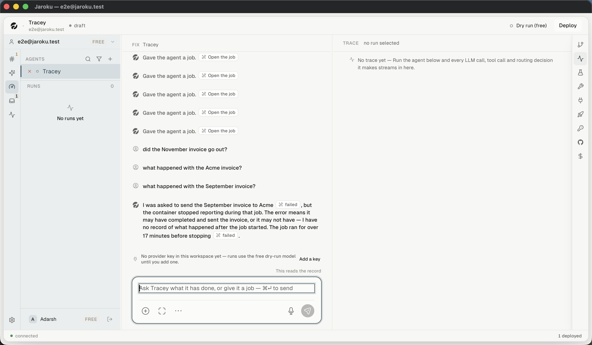
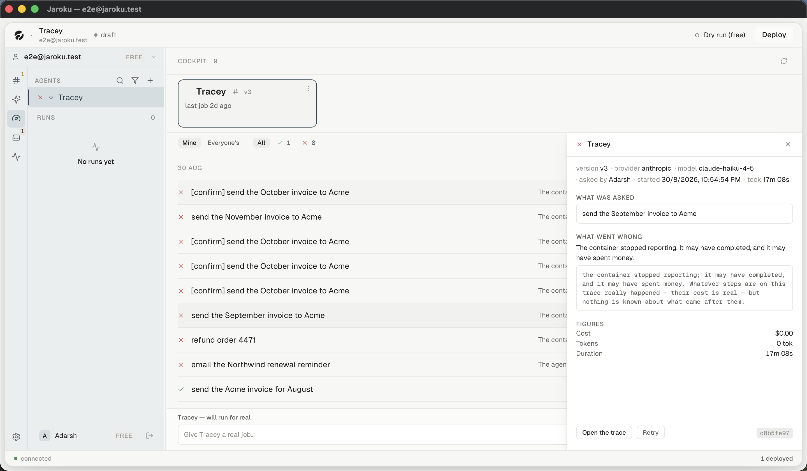

# Flow — ask a deployed agent what it has been doing

**Goal.** Ask a question, get a cited answer, follow a citation, then issue a command in the same
thread.

**Starting point.** The Cockpit's fleet strip.

---

## Steps

| # | Step | Observed |
|---|---|---|
| 1 | Click the `#` on a fleet card | ✓ — the **only** entry point; `sendCreateThread(id, name, "operate")` |
| 2 | The centre pane becomes an operate thread | ✓ — header still reads `FIX <agent>` ⚠ |
| 3 | Type a question | ✓ — the label above the composer reads **`This reads the record`** |
| 4 | `⌘↵` | ✓ |
| 5 | An answer arrives with inline **citation chips** | ✓ |
| 6 | Click a citation | ✓ — navigates to the Cockpit, opens that work item's detail, highlights the row |
| 7 | Type a command | ✓ — the label changes to **`This will run Tracey`** in the accent colour |
| 8 | Send → the **pre-flight gate** | ✓ — the same gate the Cockpit's composer uses |
| 9 | Confirm | **NOT DONE** — would dispatch to a dead container |

## The two answer states

**Answered from the record.** Verbatim:

> I was asked to send the September invoice to Acme `⌘ failed`, but the container stopped reporting
> during that job. The error means it may have completed and sent the invoice, or it may not have —
> I have no record of what happened after the job started. The job ran for over 17 minutes before
> stopping `⌘ failed`.

**The record cannot answer** — the most important state on the surface:

> I have no record of that. None of the jobs I was asked to do involved looking up customer tiers or
> enterprise subscriptions.

It refuses, names what it does not have, and does not guess.

## Important decisions

- Every keystroke is classified **before** sending, and the label says which way it went.
- The classifier decides ties **in favour of the reading that spends nothing** — *"did you send the
  invoice?"* reads the record; it does not send an invoice.
- An operate thread **cannot hold a plan or a diff** (`BuildPane.tsx:2491`).

## Side effect worth noting

Following a citation **clears the Cockpit's agent filter and the dispatch composer's text**.
Cancelling the gate does *not* clear the composer.

## Unresolved gaps

Step 9 (a command actually reaching a container) was not performed.
