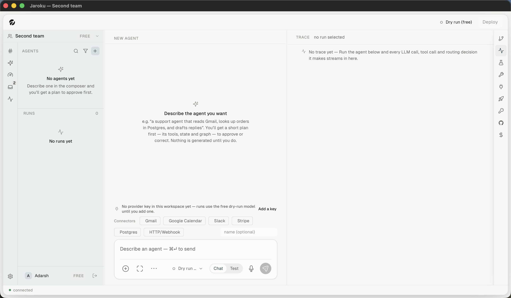

# Flow — create an agent

**Goal.** Describe an agent in plain English and get a real LangGraph project on disk.

**Starting point.** An empty workspace, or the Agents board's `+`.

## Steps

| # | Step | Observed |
|---|---|---|
| 1 | Empty workspace → the centre pane becomes a **NEW AGENT** column with connector chips | ✓ |
| 2 | Describe the agent in the composer | ✓ (input only) |
| 3 | Jaroku returns a **plan** | ✗ needs a provider key |
| 4 | Approve or amend the plan — *"nothing is written until you do"* | ✗ |
| 5 | Generation streams file by file | ✗ |
| 6 | The validator runs | ✗ |
| 7 | The agent appears on the board and in the sidebar | ✓ (seeded agents) |

## The promise the empty state makes

> You'll get a reviewable diff to apply or discard. **Nothing is changed until you apply it.**

## Unresolved gaps

Steps 3–6 need a provider key. `IMPLEMENTED / NOT CURRENTLY OBSERVABLE` — `server/src/planner.ts`,
`generator.ts`, `validator.ts`, `planProtocol.ts`; fixtures in `server/fixtures/`.
