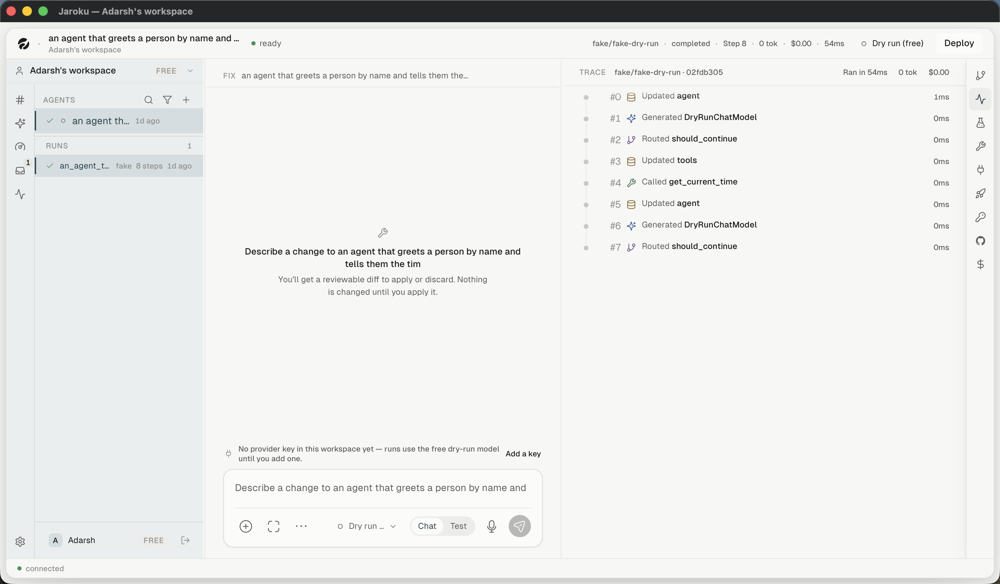

# Flow — run an agent and read its trace

## Steps

| # | Step | Observed |
|---|---|---|
| 1 | Select the agent | ✓ |
| 2 | Switch the composer to **Test** | ✓ (control observed) |
| 3 | Type the agent's runtime input | ✓ |
| 4 | `⌘↵`, or `r` from the three-pane view | — |
| 5 | A run appears in the sidebar's `RUNS` | ✓ (seeded) |
| 6 | The trace streams into the right panel | ✗ live; ✓ completed |
| 7 | Steps expand; `j`/`k` move the cursor | ✓ |

## The `r` shortcut and its history

`r` re-runs the selected agent with the **last test input**, remembered per agent **and per
workspace**. It was the subject of the most serious past failure in the codebase — see
[`../legacy/design-arguments.md`](../legacy/design-arguments.md) §V.

## Unresolved gaps

A live streaming trace, pause/resume and branching all need a provider key.
