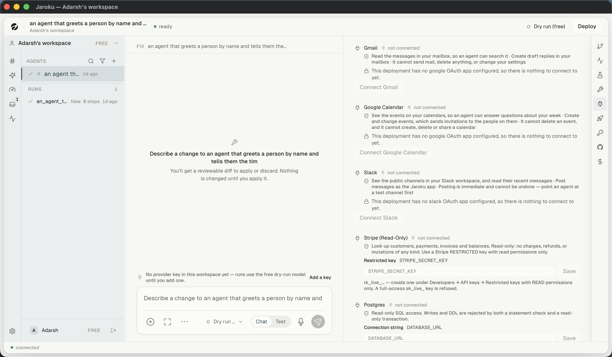

# Flow — connect an account

| # | Step | Observed |
|---|---|---|
| 1 | Open the `connections` tab | ✓ |
| 2 | Read what the connector can and **cannot** do | ✓ |
| 3 | Press `Connect <name>` | ✗ — **disabled, with a stated reason**: *"This deployment has no google OAuth app configured, so there is nothing to connect to yet."* |
| 4 | Authorise on the provider's own screen | ✗ |
| 5 | Return; the connector reads `connected` | ✗ |
| 6 | An agent's plan asks for the connector | ✗ |

For credential connectors (Stripe, Postgres) the flow is a named field plus `Save` instead of OAuth,
with format guidance — and Stripe's guidance is a refusal: *"A full-access `sk_live_` key is
refused."*

## What this flow does well

Every connector states its **limits** in the same breath as its capabilities, and the two connectors
that touch other people state a **consequence** instead: Slack's *"Posting is immediate and cannot be
undone — point an agent at a test channel first"*, Calendar's *"which sends invitations to the people
on them"*.
