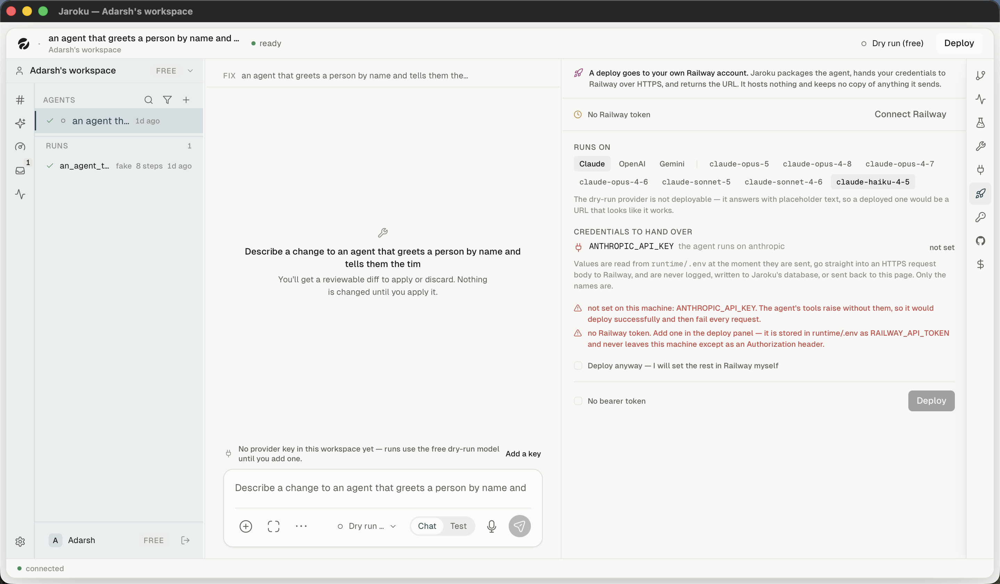
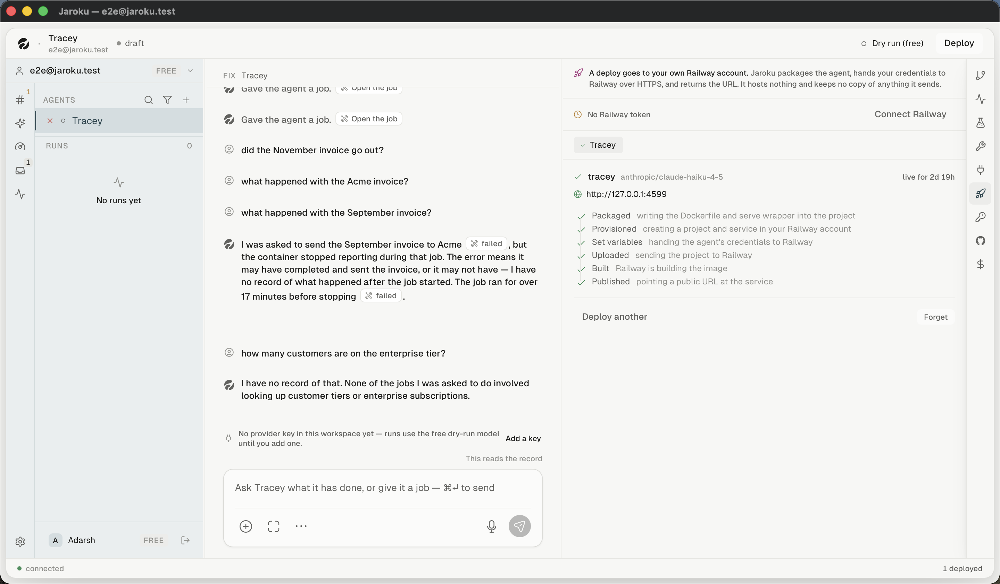

# Flow — deploy an agent

**Goal.** Get an agent onto the user's own hosting and into the Cockpit's fleet.

## Steps

| # | Step | Observed |
|---|---|---|
| 1 | Open the `deploy` right-panel tab | ✓ |
| 2 | Read the standing notice — *"Jaroku hosts nothing and keeps no copy of anything it sends."* | ✓ |
| 3 | `Connect Railway` | ✗ no token |
| 4 | Pick the agent | ✓ (chip observed on the live deployment) |
| 5 | The six-step ladder runs: Packaged → Provisioned → Set variables → Uploaded → Built → Published | ✓ **as a completed ladder** |
| 6 | A URL is returned | ✓ |
| 7 | The agent appears in the **Cockpit's fleet strip** | ✓ |

## The seam into the Cockpit

A deployment is what makes a fleet card exist. The Cockpit's empty state points back at this panel —
*"Deploy an agent from its Deploy panel and it will appear here"* — which is the only cross-area
empty-state pointer in the product.

## Destructive controls here

`Forget` and `Deploy another`, **neither of which was observed to confirm anything**. See
[`../findings/inconsistencies.md`](../findings/inconsistencies.md) §6.

## Unresolved gaps

Provisioning, building, degraded, failed, stopped, updating and rollback all need a Railway token.
