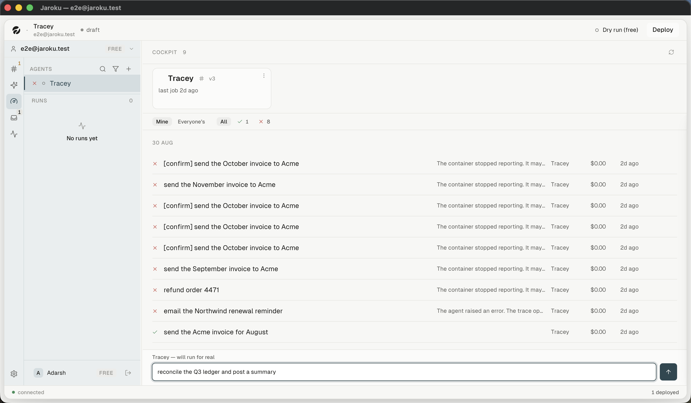
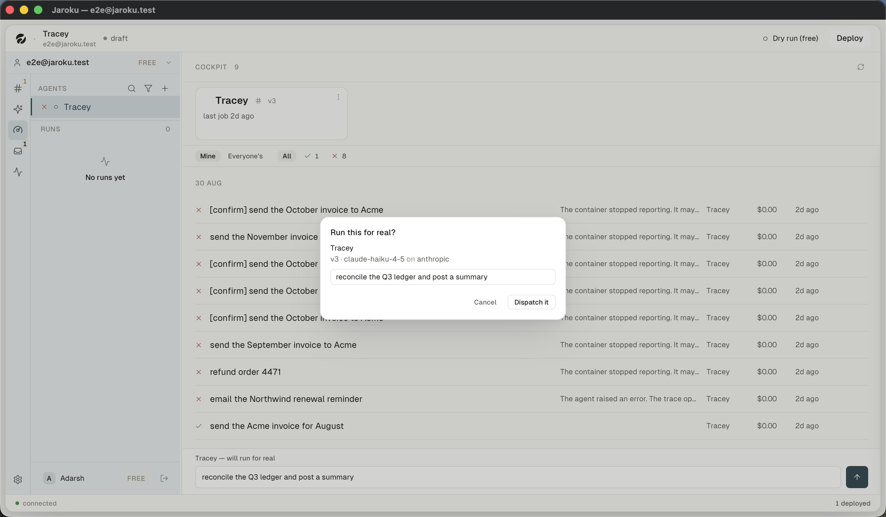

# Flow — dispatch a job to a live agent

**Goal.** Give a deployed agent a real job and see it through to a terminal state.

**Starting point.** The Cockpit, with at least one live agent.

---

## Steps — as observed

| # | Step | Screen | Observed |
|---|---|---|---|
| 1 | Open the Cockpit | rail item 3 · palette · a fleet card · a deep link | ✓ |
| 2 | *(optional)* narrow to one agent by clicking its fleet card | fleet strip | ✓ — sets an `Only Tracey ×` chip and **removes the agent column** from the rows |
| 3 | Type the job | dispatch composer | ✓ — the label above reads `Tracey — will run for real` **before** you type |
| 4 | Press send | — | ✓ |
| 5 | **The pre-flight gate opens** | modal | ✓ |
| 6 | Read: agent · version · model · provider · the first line of the input | gate | ✓ |
| 7 | `Cancel` or `Dispatch it` | gate | ✓ **Cancel** — nothing was dispatched in this audit |
| 8 | An optimistic row appears reading `Sending…` | work list | **NOT OBSERVED** |
| 9 | The row moves `queued → running` | work list | **NOT OBSERVED** |
| 10 | The row reaches a terminal state | work list | **NOT OBSERVED** live (terminal rows exist in the seed) |
| 11 | Open the detail | detail panel | ✓ |
| 12 | `Open the trace` | trace tab | route confirmed; the run has no local trace |

## Important decisions

- **The gate is the only confirmation, deliberately.** An ambiguous message classified as a command
  meets the same gate; there is no second dialog beside it (`WorkGate.tsx:1-12`).
- **The gate names what will happen, not what it will cost.** Nothing can honestly price a graph that
  has not run.
- **A deployment with no recorded version says so** rather than guessing.
- **The confirming control is not the default focus.**

## Success path

composer → gate → optimistic row → `queued` → `running` → `succeeded` → detail shows
`WHAT CAME BACK` + `FIGURES` → `Open the trace`.

## Failure path

Six failure kinds, each with its own sentence. Two observed. `stopped_reporting` additionally
renders a verbatim block that refuses to claim the job failed.

## Recovery path

`Retry` in the detail panel — disabled with a stated reason when the role lacks `run:execute`.

## Keyboard

`⌘K → "Dispatch to <agent>"` opens the Cockpit filtered and pointed at that agent — **it does not
send**. Composer send is `⌘↵`. The gate traps focus and `Esc` cancels.

## Permissions / plan

Dispatch needs `run:execute`. Denial is **absent**, not disabled — `REFUSAL.dispatch` exists and is
never used. Not observable (all seeded accounts are `owner`).

## Unresolved gaps

Steps 8–10 could not be reached: the deployment's URL is `http://127.0.0.1:4599` and nothing answers
there. **No job was dispatched.**
