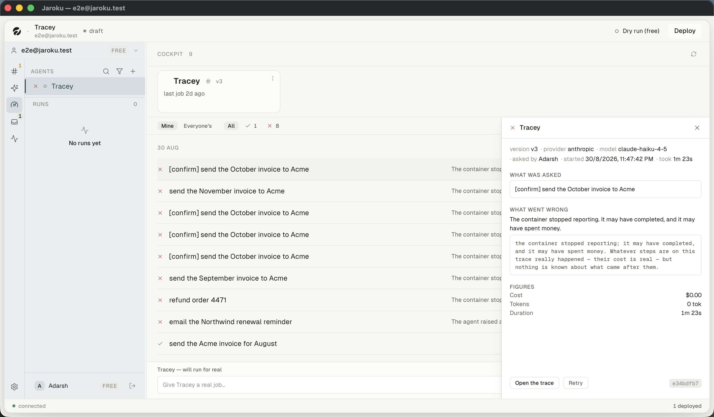

# Flow — a job fails in production

**Goal.** A job fails overnight; work out what happened, read the runtime logs, and stop the agent
if it is misbehaving.

**Starting point.** The morning after. This is the brief's own question: *"What does the operator see
the morning after a job failed overnight?"*

---

## What the operator actually sees — observed

| # | Step | Observed |
|---|---|---|
| 1 | The rail's Cockpit badge — counts `waiting` only, so **a failed job does not badge** | ✓ (by construction) |
| 2 | Open the Cockpit | ✓ |
| 3 | The filter bar reads `All · ✓ 1 · ✗ 8` — the failure count is on the chip | ✓ |
| 4 | The record, grouped by day, with red ✗ glyphs down the spine | ✓ |
| 5 | Each failed row carries **its failure sentence inline**, not the word "failed" | ✓ |
| 6 | Click the row → the detail panel | ✓ |
| 7 | `WHAT WAS ASKED` · `WHAT WENT WRONG` · a verbatim block · `FIGURES` | ✓ |
| 8 | `Open the trace` | route confirmed |
| 9 | `Retry` | ✓ present |
| 10 | Read the **runtime logs** | ⚠ **unreachable — the menu is clipped** |
| 11 | `Kill` the service | ⚠ **unreachable — the menu is clipped** |

## What this flow does well

- The row says **what went wrong**, not that something did. Six kinds exist so six things can be
  said.
- `stopped_reporting` refuses to overclaim: *"It may have completed, and it may have spent money."*
- The figures name their own uncertainty — a cost that could not be fully priced is *"a floor rather
  than a total"*.
- The detail panel is `role="complementary"` and does not trap focus, so the list stays scannable
  beside it, and `Escape` returns focus to the row.

## Where it breaks

Steps 10 and 11. Runtime logs and Kill both live in the clipped fleet-card menu. An operator who has
read the failure and wants the container's own output has **no route to it in the product**.

## Recovery paths available

| Want | Route | Works? |
|---|---|---|
| See the steps | `Open the trace` | ✓ |
| Run it again | `Retry` | ✓ |
| See container output | fleet card → `Logs` | ✗ clipped |
| Stop the service | fleet card → `Kill` | ✗ clipped |
| Fix the token | fleet card → `Reconnect` | ✗ clipped |
| Ask in words | the `#` → operate thread | ✓ — and it answers honestly |

**The operate thread is the only working escape hatch** from a Cockpit failure, and it is the one
route that is not a control on the failing card.
