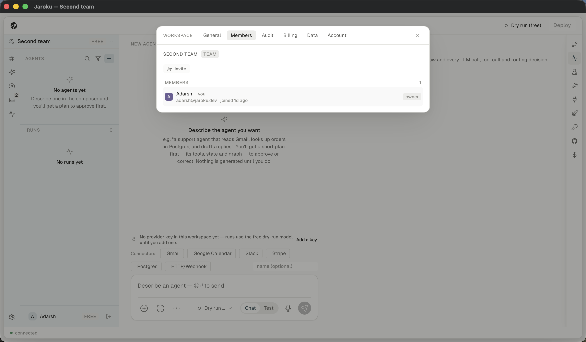

# Flow — add somebody to a workspace

| # | Step | Observed |
|---|---|---|
| 1 | Create or switch to a **team** workspace | ✓ |
| 2 | Workspace panel → **Members** (absent on a personal workspace) | ✓ |
| 3 | Invite | ✗ (`InviteWithGrantDialog`) |
| 4 | Grant per-agent access | ✗ (`GrantDialog`) |
| 5 | They redeem the invite | ✗ (`InviteNotice`, `lib/invite.ts`) |
| 6 | Change a role | ✗ |
| 7 | Remove a member — **ownership is transferred, not dropped** (`socket.ts:1636`) | ✗ |

Every seeded workspace has exactly one member, so steps 3–7 were unreachable.
