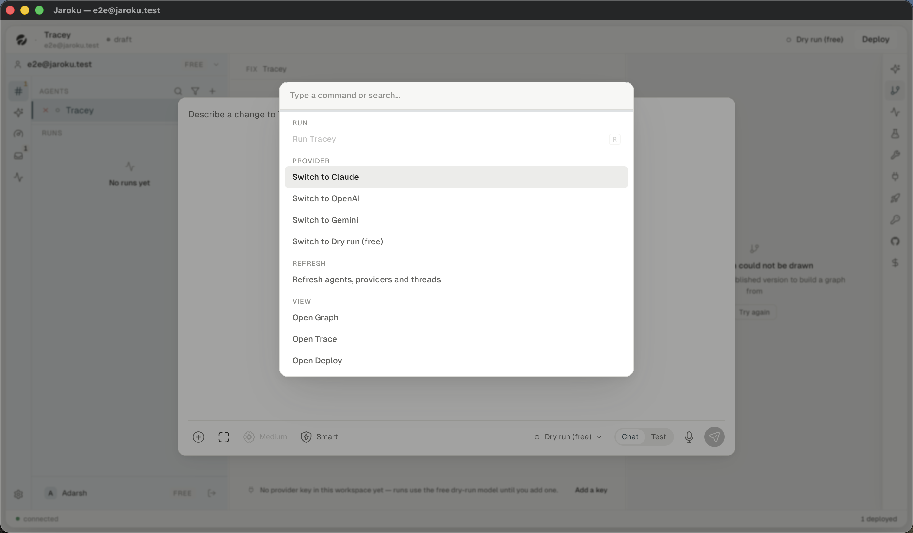
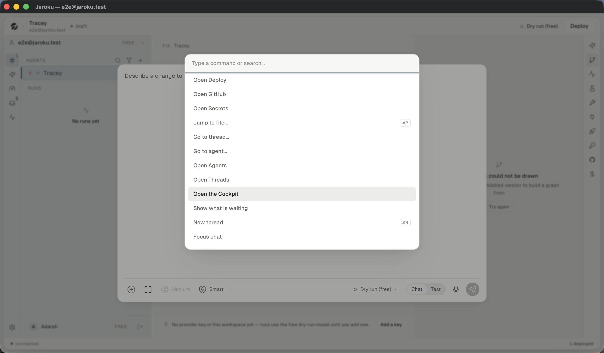

# Navigation — keyboard

## The ownership rule

A bare letter belongs to **whichever surface owns the screen**. The rule is a module,
`client/src/lib/bareKeys.ts`, and it exists because it used to be a condition copied at five call
sites — and the sixth listener was written without it. That listener was `R` (run the agent), which
stayed live on `window` from `BuildPane` while a full-screen destination was up, so:

> pressing `r` on the Threads board … dispatched a real run of whichever agent was selected in the
> sidebar. Nothing on screen changed to say so. On a workspace with a provider key that spends
> money, with no confirmation and no visible result — and `r` is a plausible keystroke on a board
> where somebody expects typing to reach a filter field.
> — `lib/bareKeys.ts:8-15`

Two predicates, because there are two kinds of owner: a three-pane handler must stand down while a
destination owns the screen; a destination's handler must not. `npm run test:bare-keys` asserts it.

## Application chords — live everywhere

Registered once, on `window`, in `CommandPalette.tsx:111-172`.

| Chord | Does |
|---|---|
| `⌘K` / `Ctrl+K` | toggle the command palette (root mode) |
| `⌘P` / `Ctrl+P` | open the palette in **file** mode ("Jump to file…") |
| `⌘N` / `Ctrl+N` | new thread — *and closes the palette on the way* |
| `⌘↵` | send, in every composer |
| `⌘/` | opens the composer's `⊕` attach menu — bound in `BuildPane`, **not** here |

`⌘N` was moved here from `useThreadKeys` deliberately: it was drawn as a keycap in a palette
reachable from everywhere, but only bound in a view mounted on one screen out of five, so on
Windows `Ctrl+N` fell through to the webview and opened a window.

## Three-pane / trace keys

| Key | Does |
|---|---|
| `j` / `J` | next trace step |
| `k` / `K` | previous trace step |
| `↵` | expand/collapse the selected step |
| `r` / `R` | re-run the selected agent with the last test input — **now gated by `bareKeys`** |

## Threads board — `useThreadKeys.ts`

| Key | Does |
|---|---|
| `j` / `k` | move the row cursor (first press selects the first/last row) |
| `↵` | open the thread |
| `e` | archive immediately — **no confirmation**; a notice names what was set aside afterwards |
| `p` | pin the row's **agent** (not the thread) |
| `/` | focus the filter field |
| `1`–`5` | the filter chips, by position |
| `⌘↵` | (in the composer) send |

## Inbox board — `useInboxKeys.ts`

| Key | Does |
|---|---|
| `j` / `k` | move the card cursor |
| `↵` | open / expand the card |
| `e` | archive |
| `x` | dismiss |
| `s` | snooze |
| `1`–`n` | snooze durations, by digit (`BY_DIGIT`) |
| `Esc` | close the open card |
| `/` | focus the filter |
| `⌘Z` | undo the last inbox action |

## The Cockpit — what it actually supports

This is the brief's specific question, and the answer is uneven.

| Surface | Keyboard behaviour | Evidence |
|---|---|---|
| **Fleet strip** | **Fully traversable.** `role="list"` / `role="listitem"`, a roving tabindex (`tabIndex={i === 0 ? 0 : -1}`), and an arrow-key handler that moves between cards | `FleetStrip.tsx:536-547`, `:282-317` |
| **Work list** | **Tabbable but not navigable.** Every row is a real `<button>`, so Tab reaches each one — but there is **no `j`/`k`, no arrow keys and no roving tabindex**. A list of 10 000 rows is 10 000 tab stops | `WorkList.tsx:115-118`; no `onKeyDown` anywhere in the file |
| **Filter bar** | `role="group"` with `aria-label` on both the scope and the status groups | `WorkList.tsx:343`, `:359` |
| **Work detail panel** | `Escape` closes it and **returns focus to the row that opened it** — explicitly, and it works from anywhere inside the panel | `WorkDetail.tsx:234-256` |
| **Pre-flight gate** | A modal via `CockpitDialog`. The confirming control (`Dispatch it`) is **deliberately not the default focus** | `cockpitCopy.ts:220`, `WorkGate.tsx:24-26` |
| **Fleet card overflow** | `role="menu"` / `role="menuitem"`, dismissed by outside click or `Escape` — but see the clipping finding, which makes it unusable with a pointer *and* leaves the focused items off-screen | `FleetStrip.tsx:126-155` |

**The work list is the gap.** Threads and the Inbox both have a full `j`/`k`/`↵`/`e` row grammar;
the Cockpit's list — the one surface in the product built for an operator scanning a long record —
has none of it.

## Cockpit verbs in the command palette

All three named verbs are registered (`CommandPalette.tsx:342-388`):

- **Open the Cockpit**
- **Show what is waiting** — sets scope `all` + status `waiting` **before** navigating, so a busy
  workspace never renders unfiltered for a frame
- **Dispatch to \<agent\>** — appears only once a query is typed, and is a *navigation*, not a
  dispatch: it opens the Cockpit filtered to that agent with the composer pointed at it. The
  palette deliberately never sends the job, because the gate is what stands between the composer
  and the container.

They are present but **below the fold** of the palette's list in its resting state, with no visible
scroll affordance. See [`findings/ux-debt.md`](../findings/ux-debt.md).

