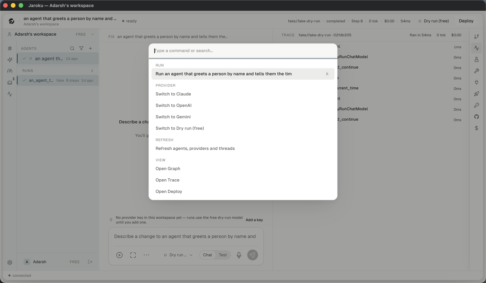

# Navigation — search and the command palette

There is **no global search**. There are four scoped filters and one palette.

## The command palette

`⌘K`. Built on `cmdk`. Four modes: `root`, `files` (`⌘P`), `threads`, `agents`.

### Root groups, in order

| Group | Entries |
|---|---|
| `RUN` | Run \<agent\> — with an `R` keycap |
| `AGENTS` | matching agents, once a query matches (live agents only; archived are excluded) |
| `PROVIDER` | Switch to Claude / OpenAI / Gemini / Dry run (free) |
| `REFRESH` | Refresh agents, providers and threads |
| `VIEW` | Open Graph · Trace · Deploy · GitHub · Secrets · Jump to file… · Go to thread… · Go to agent… · Open Agents · Open Threads · **Open the Cockpit** · **Show what is waiting** · *Dispatch to \<agent\>* · New thread · Focus chat |

The query box is **cleared on every open and on every mode change** — reopening onto the last
search "would filter the command list against a word they have forgotten typing"
(`CommandPalette.tsx:174-177`).

### Archived threads are excluded

"Go to thread…" filters `archived_at === null`, because §3.4 says an archived thread leaves the
default list and "*Go to thread…* is a default list" (`CommandPalette.tsx:105-109`).

## The four scoped filters

| Surface | Control | Focus key |
|---|---|---|
| Sidebar `AGENTS` | a magnifier and a funnel | — |
| Threads board | a `filter…` field + 5 chips (All / Needs you / Running / Recent / Archived) | `/`, and `1`–`5` for the chips |
| Agents board | `search agents…` + a funnel + a sort select + a grid/table toggle | — |
| Cockpit | scope (Mine / Everyone's) + status (All / ✓ / ✗) + an agent chip | — |

The Cockpit's filter bar is the only one with **no text field at all** — a work list cannot be
searched by its input text.
