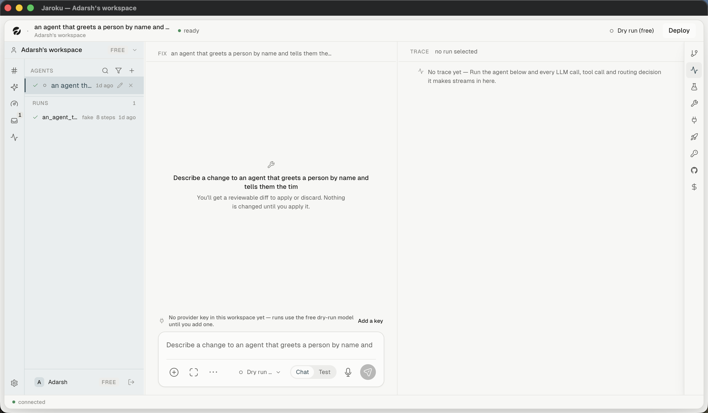

# Navigation — the sidebar

Two columns that read as one: a **32px icon rail** and a **panel** beside it.

## The rail

Top to bottom: the five destinations (see [`sitemap.md`](sitemap.md)), then `mt-auto`, then a gear.

The gear is labelled **"Provider keys"** (`title` and `aria-label`, `Sidebar.tsx:458-459`) and opens
the provider popover. It is not a settings entry point. Its own comment records that it replaced a
`⚙ Settings ›` row "that spent a whole line on one word and a chevron that pointed at nothing
navigable" — the chevron went, the gear stayed, and the word "Settings" went with it.

## The panel

| Section | Contents |
|---|---|
| Workspace chip | workspace name · plan · a chevron opening the switcher |
| `AGENTS` | search, filter, `+`; then the agent rows, each with a lifecycle glyph |
| `PINNED` | pinned agents (set with `p` on the Threads board) — empty in the seed |
| `RUNS` | recent runs, with a count; `No runs yet` when empty |
| User chip | avatar · display name · plan · sign-out |

### What the panel does *not* do

- It never collapses. There is no collapse control and no width memory beyond the drag.
- It is resizable by dragging the seam, with a **measured pixel floor** rather than a percentage
  one (`App.tsx`, `lib/paneFloor.ts`).
- It does not change with the destination. The Agents list is in the panel while the Cockpit is on
  screen, which is why the Cockpit's own agent filter is a separate chip in its filter bar.

## The seam

`PaneDivider` in `App.tsx:88-101`: painted **1px**, hit at **5px**, `cursor-col-resize` at rest —
because `react-resizable-panels` only injects a cursor once a drag is underway, so "the only way to
find out it was draggable was to try. An affordance that appears after you commit to the action is
not an affordance." A 2×16px grip appears on hover at the vertical centre.

## Badges — what each one counts

| Badge | Counts | Source |
|---|---|---|
| Threads (`#`) | threads whose status needs the reader | `threadStore` |
| Cockpit (gauge) | work items with status `waiting` | `workStore.workBadgeCount(workspaceCounts)` |
| Inbox (tray) | items in the `BLOCKING` lane | `inboxStore` |
| GitHub (right panel) | unpushed / failing checks | `githubStore` |

**Do two badges count the same thing?** No — and this was designed against explicitly. A deployed
run waiting on an MCP confirmation is *blocking* in the Inbox's sense and *waiting on you* in the
Cockpit's; the product picked one home (the Cockpit) and gave the Inbox a **pointer strip** instead
of a second card. `CockpitPointer.tsx:3-12` quotes the rule:

> Two boards showing the same thing is how both stop being believed.

The Cockpit's count is computed once and rendered in three places — the rail badge, the Cockpit
header and the pointer strip — from the same snapshot, so the three cannot disagree
(`CockpitPointer.tsx:19-22`).
