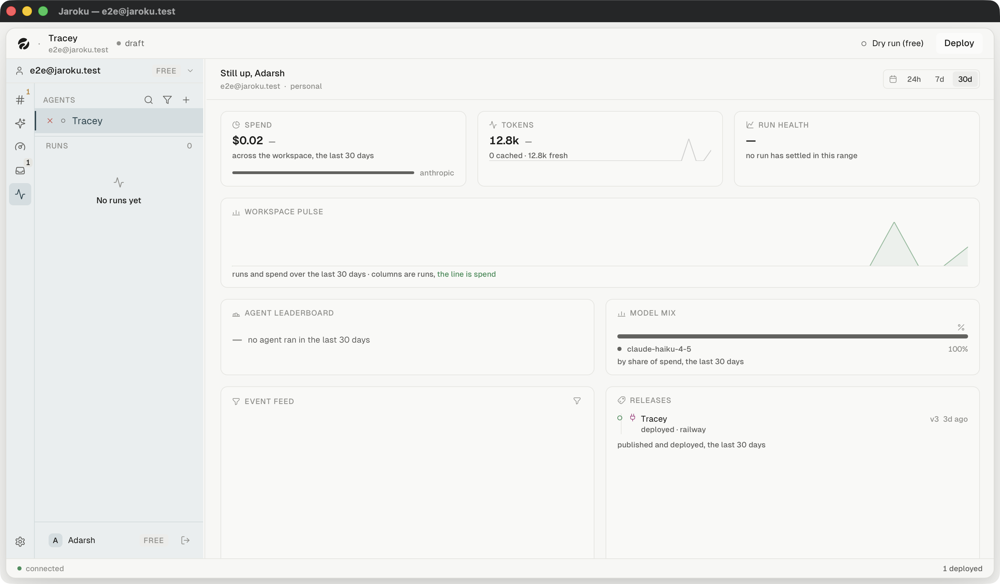

# SCREEN — Activity

| | |
|---|---|
| **Screen ID** | `ACT-01` |
| **Screen name** | Activity |
| **Route / path** | `navView = "activity"` (rail item 5) |
| **Parent area** | Activity |
| **Purpose** | What the workspace has been doing, over a range |
| **Primary user goal** | *"Is anything unusual happening?"* |

## Header

A **time-aware greeting** — `Good afternoon, Adarsh`, `Still up, Adarsh` — then
`<workspace> · <kind>`. Right: a range switch, `24h | 7d | 30d`, with a calendar glyph.

## Cards

| Card | Contents |
|---|---|
| **SPEND** | a figure, a delta, *across the workspace, the last 30 days*, and a **share bar** with the provider named beside it |
| **TOKENS** | a figure, `0 cached · 12.8k fresh`, and a sparkline |
| **RUN HEALTH** | a figure or an em dash + *no run has settled in this range* |
| **WORKSPACE PULSE** | a combined chart — *runs and spend over the last 30 days · columns are runs, **the line is spend*** |
| **AGENT LEADERBOARD** | ranked agents, or *— no agent ran in the last 30 days* |
| **MODEL MIX** | a share bar + a legend + *by share of spend, the last 30 days* |
| **EVENT FEED** | a filterable feed, with a funnel control |
| **RELEASES** | published and deployed versions — `Tracey · deployed · railway · v3 · 3d ago` |

### The share bar's colours

Both the SPEND strip and MODEL MIX use `SHARE_RAMP` — **five steps of neutral lightness, no hue**.
This replaced two independent hardcoded palettes that handed Anthropic `#c98a5e` and Groq `#c99a52`,
both within a few degrees of `STATUS.pending` — so *"a workspace using one model painted a
full-width amber bar under the word SPEND, which reads as a warning or as something in flight rather
than as a proportion, on the one page built to be quiet"* (`tokens.ts` `SHARE_RAMP`).

The chart legend is the reason the bar can be quiet: every one of these surfaces names its series in
a row beneath the bar.

## The empty-range discipline

A range with no model call in it still has a full row of zero buckets, so the tokens card used to
draw a flat line along its own floor under a sentence saying nothing had run. It no longer does —
see commit `f4e4420`. `RUN HEALTH` and `AGENT LEADERBOARD` both use an em dash plus a sentence.

## State list

| State | Screenshot | Notes |
|---|---|---|
| 24h | `range-24h.png` | Observed |
| 7d | `default.png` | Observed |
| 30d | `range-30d.png` | Observed |
| loading | — | `IMPLEMENTED / NOT CURRENTLY OBSERVABLE` — `ActivityFeed.tsx:157-165` skeleton |
| event feed populated | — | `IMPLEMENTED / NOT CURRENTLY OBSERVABLE` |
| feed filtered by kind | — | `IMPLEMENTED / NOT CURRENTLY OBSERVABLE` — `FEED_KINDS`, `actionForFeedKind` |

## Observed defect — the event feed shows nothing at all

**Reproduced in two separate sessions, at 30d.** Every other card on this dashboard answers an empty
range with an em dash and a sentence. The `EVENT FEED` card renders a **tall blank region with no
text**, no figure and no explanation.

The component has both a skeleton and an empty sentence (`ActivityFeed.tsx:157-170`):

- skeleton: a `bg-hair/40` block at `FEED_HEIGHT`, `aria-busy`
- empty: `— nothing happened in the last 30 days` at 64px

Neither is legible in the rendered card. `bg-hair/40` is `#E6E6E2` at 40% on a card that is already
`#FBFBFA`, so **a feed still loading and a feed that is genuinely empty look identical — and both
look like a rendering fault.** The one card on the dashboard with a `role`-free blank box is the one
card whose job is to say what happened.

## Implementation references

`ActivityDashboard.tsx` · `ActivityView.tsx` · `ActivityHero.tsx` · `ActivityCards.tsx` (27 KB) ·
`ActivityFeed.tsx` · `ActivityFigures.tsx` · `ActivityTeam.tsx` · `activityIcons.tsx` ·
`store/activityStore.ts` · `lib/activityMetrics.ts`, `activityRange.ts`, `feedWindow.ts` ·
`tokens.ts` `SHARE_RAMP` / `SHARE_ORDER` · channel `activity` · `server/src/activity/`
