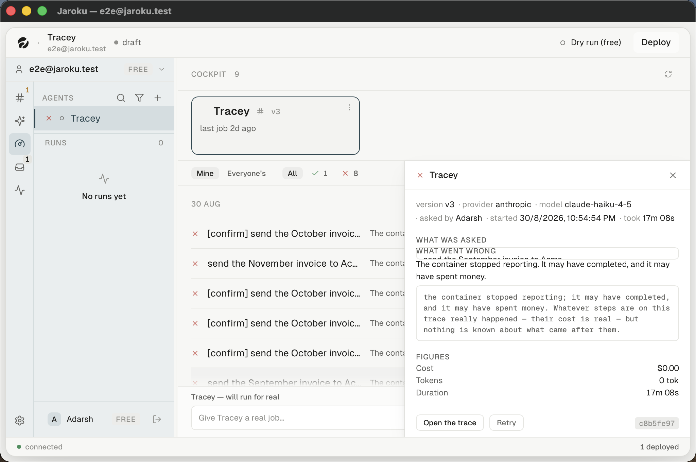

# SCREEN — Work detail

| | |
|---|---|
| **Screen ID** | `CKP-03` |
| **Screen name** | Work detail |
| **Route / path** | a panel over the work list; opened by a row or a citation |
| **Parent area** | Cockpit |
| **Purpose** | Everything known about one job |
| **Primary user goal** | *"What actually happened, and what did it cost?"* |

## Regions, top to bottom

1. **Header** — the job's status glyph · the agent name · a close `×`
2. **Metadata line** — `version v3 · provider anthropic · model claude-haiku-4-5 · asked by Adarsh · started 30/8/2026, 11:47:42 PM · took 1m 23s`
3. **`WHAT WAS ASKED`** — the input, in a bordered box
4. **`WHAT CAME BACK`** *(success)* or **`WHAT WENT WRONG`** *(failure)*
5. **`FIGURES`** — Cost · Tokens · Duration
6. **Footer** — `Open the trace` · `Retry` · the job id chip (`Copy this job's id`)

Sections 3 and 4 are the same slot wearing two labels — the panel never shows both.

## Failure kinds — six sentences, and each says something different

`cockpitCopy.ts:118-126`. **Each names the thing and then the action.**

| Kind | Sentence | Observed |
|---|---|---|
| `unauthorised` | The stored token is wrong. Reconnect this agent. | no |
| `agent_error` | The agent raised an error. The trace opens on the failing step. | **yes** |
| `rejected` | Jaroku sent something this agent refused — this is a bug on our side. | no |
| `unreachable` | The container could not be reached. | no |
| `stopped_reporting` | The container stopped reporting. It may have completed, and it may have spent money. | **yes** |
| `busy` | The agent was at capacity. | no |

**Do they read differently in the panel?** For the two observed, unambiguously yes — and
`stopped_reporting` goes further than a sentence. Below it the panel renders a verbatim block:

> the container stopped reporting; it may have completed, and it may have spent money. Whatever
> steps are on this trace really happened — their cost is real — but nothing is known about what
> came after them.

The hedge is deliberate. `cockpitCopy.ts:112-114`: it is *"the absence of an observation rather than
an observation, and rendering it as 'failed' would be a confident claim about somebody's bill."*

## Unknown figures

An em dash is never bare. `DETAIL` in `cockpitCopy.ts:309-324` gives each its own sentence, because
*"an em dash with no explanation is a figure the reader assumes is a bug in the product rather than
an absence in the record"*:

| Figure | When unknown |
|---|---|
| Cost, nothing priced | *Nothing here could be priced, so there is no total to show.* |
| Cost, partly priced | *Part of this run could not be priced, so this is a floor rather than a total.* |
| Tokens | *No step reported a token count.* |
| Duration | *This job has not ended, so it has no duration yet.* |
| Truncated output | *the rest was not stored — this is where the record stops* — said **where the text ends** |
| Empty output | *the agent produced nothing* |

## Accessibility — a deliberate non-dialog

`WorkDetail.tsx:323-325`: `role="complementary"`, `aria-label="Job"`, `aria-hidden={!open}`.

**It is not a dialog and it does not trap focus** — and its behaviour matches that: the list behind
it stays live and clickable, and a second row can be opened without closing the first. `Escape`
closes it and **returns focus to the row that opened it**, from anywhere inside the panel
(`WorkDetail.tsx:234-256`).

Role and behaviour agree. This is the correct answer to the brief's question.

## Permission behaviour

`WorkDetail.tsx:285-286` — the only two Cockpit controls that **deny with a stated reason**:

```ts
const cancelState = canCancel ? ENABLED : { reason: REFUSAL.cancel };
const retryState  = canRetry  ? ENABLED : { reason: REFUSAL.retry };
```

`REFUSAL.dispatch`, `REFUSAL.reconnect` and `REFUSAL.kill` are defined and **never used** — those
three verbs deny by absence instead. See
[`../../../findings/inconsistencies.md`](../../../findings/inconsistencies.md).

## State list

| State | Screenshot |
|---|---|
| failed — `stopped_reporting` | `failed-stopped-reporting.png` |
| failed — `agent_error` | `failed-agent-error.png` |
| succeeded | `succeeded.png` |
| opened from a citation | `opened-from-a-citation.png` |
| **narrow (1024×680)** | `default-narrow.png` — **broken; see below** |
| running / waiting / cancelled / queued | `IMPLEMENTED / NOT CURRENTLY OBSERVABLE` |

## Screenshot safety

Checked specifically, as the brief requires: **no deployment URL, bearer token, run token or
phone-number-like identifier appears in any work-detail screenshot.** The metadata line carries
version, provider, model, actor, timestamp and duration only. The id chip shows an 8-character
prefix (`c8b5fe97`), not a token.

## Observed defect — the panel overprints itself at the minimum window size

At **1024×680 — the shell's own enforced minimum** (`src-tauri/src/window.rs:29`) — the
`WHAT WENT WRONG` heading is drawn **on top of** the `WHAT WAS ASKED` value box, and the asked text
is cut through the middle. Reproduced at both 1024×700 and exactly 1024×680.

`window.rs:11-15` names the destinations that have a narrow-width fallback — *"Threads, Agents,
Inbox and Activity"*. The Cockpit is not among them, and it was added after that comment.



## Implementation references

`WorkDetail.tsx` (26 KB) · `WorkGlyph.tsx` · `DisabledReason.tsx` · `Truncate.tsx` ·
`lib/cockpitCopy.ts`, `cockpitFormat.ts`, `workLink.ts` · `store/workStore.ts` ·
`server/src/work/payload.ts`, `cost.ts`, `snapshot.ts`
