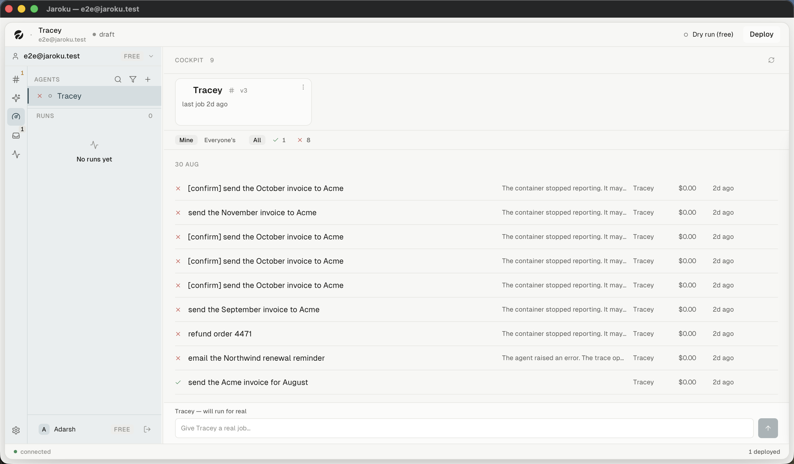
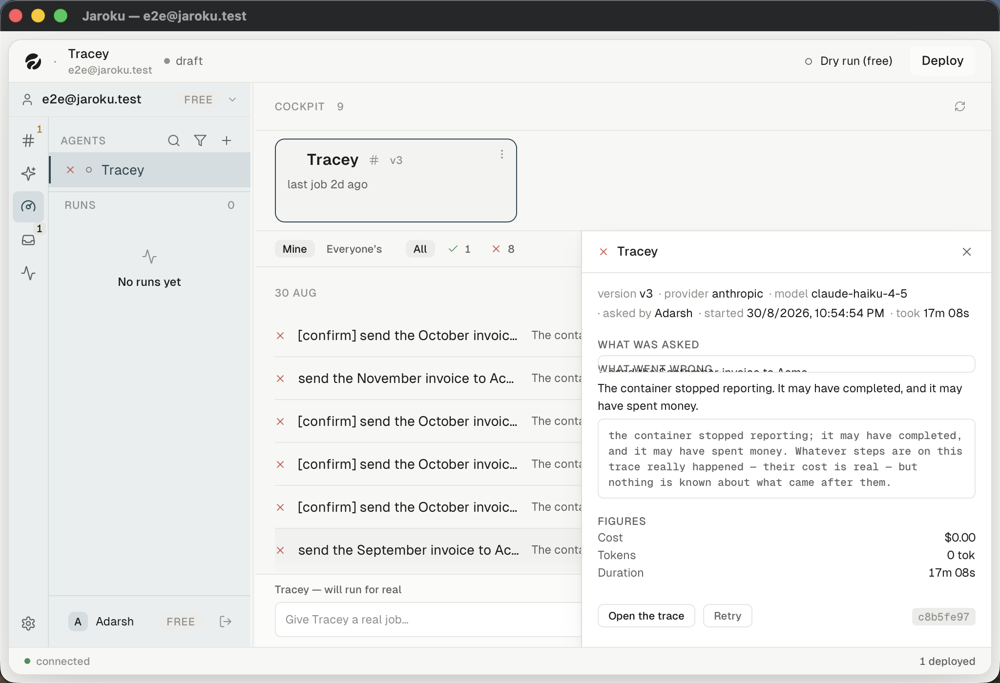

# SCREEN — Cockpit work list

| | |
|---|---|
| **Screen ID** | `CKP-02` |
| **Screen name** | Work list (the record) |
| **Route / path** | `navView = "work"` (rail item 3) |
| **Parent area** | Cockpit |
| **Purpose** | Everything the workspace's deployed agents have been asked to do |
| **Primary user goal** | *"What happened overnight?"* |

**The Cockpit is a fifth top-level destination**, not a sub-area of Agents or Deployments. It has
its own layout, its own store (`workStore`), its own channel (`work`) and its own rail slot.

## Screen composition

| Band | Region |
|---|---|
| 1 | Header — `COCKPIT <n>` and a refresh control (*"Ask for the fleet and the list again"*) |
| 2 | **Fleet strip** — a horizontal track of deployed-agent cards |
| 3 | **Filter bar** — scope, status, and an agent chip when one is set |
| 4 | **The record** — day-grouped rows |
| 5 | **Dispatch composer** — pinned to the bottom |

The detail panel slides over bands 3–5 from the right; it does not push them.

## The filter bar

| Group | Controls | `role` |
|---|---|---|
| Scope | `Mine` \| `Everyone's` | `group`, `aria-label="Whose work to show"` |
| Status | `All` · `✓ 1` · `✗ 8` | `group`, `aria-label="Filter by status"` |
| Agent | `Only Tracey ×` — set by clicking a fleet card | — |

The status chips carry **counts, not just labels**, and they are the glyph set rather than words.
The scope toggle is **never gated** (`cockpitCopy.ts:275`), so neither label is ever a refusal.

There is **no text field**. A work list cannot be searched by what was asked.

## Row anatomy — six slots, in order

`WorkList.tsx:112-200`:

| # | Slot | Behaviour |
|---|---|---|
| 1 | **status glyph** | fixed at `ICON.xs`, on the spine — *"it never leaves"* |
| 2 | **the input** | one line, `variant="prose"`, at `body`; the widest element |
| — | *failure sentence* | not a column — prose, `max-w-[28ch]`, on the minority of rows that have one, `hidden md:block` |
| 3 | **agent name** | **absent when the list is filtered to one agent** |
| 4 | **actor** | `all` scope only, at `text-faint` |
| 5 | **cost** | tabular, fixed `8ch`, or an em dash carrying its reason |
| 6 | **time** | relative, right-aligned, *"it never leaves"*; the exact instant is the hover title |

The whole row is one `<button>`, with controls kept **outside** it — *"a button nested in a button
is a hit area that swallows the row's own click, which is the bug the Inbox's `view_evidence`
control had"* (`WorkList.tsx:112-115`).

### The `waiting` marker

A 2px amber bar on the left edge, and **exactly one status wears it** (`WorkList.tsx:96-111`).
`failed` deliberately does not: *"a list where a fifth of the rows are marked is a list nobody
scans."* `waiting` earns it by being the only status where a **person** is the blocker.
`IMPLEMENTED / NOT CURRENTLY OBSERVABLE`.

## The six work statuses

`cockpitCopy.ts:136-143`. Six statuses, six marks (`WorkGlyph.tsx`), each named for screen readers:

| Status | Word | Observed |
|---|---|---|
| `queued` | queued | no |
| `running` | running | no |
| `waiting` | **waiting on you** — *not* "waiting", because "waiting" leaves the reader to guess whether the machine or a person is the blocker, and it is always a person | no |
| `succeeded` | succeeded | **yes** — green ✓ |
| `failed` | failed | **yes** — red ✗ |
| `cancelled` | cancelled | no |

**Are the marks visually distinguishable?** For the two observed, yes and strongly — a green check
and a red cross differ in both hue and shape. The other four could not be rendered. `workGlyphs.test.ts`
asserts all six are distinct.

## Day grouping

Rows group under an uppercase day label (`30 AUG`). Nine rows, one group, in the seed.

## Empty states — three, deliberately distinguishable

`cockpitCopy.ts:152-165`. They must not collapse into one, because they call for three different
things:

| State | Copy | Action |
|---|---|---|
| No agents live | *No agents are live yet.* + a hint about the Deploy panel | `Open the Deploy panel` |
| Live agents, nothing asked | *Nothing has been asked of them yet.* | none — the composer below is the answer |
| A filter matched nothing | *Nothing here matches this filter.* | `Show everything` |

> Collapsing any two would tell an operator with forty jobs that nothing has been asked of their
> agents, because they had clicked "failed".

## State list

| State | Screenshot | Notes |
|---|---|---|
| empty (no agents) | [`../cockpit-empty/empty.png`](../cockpit-empty/empty.png) | Observed |
| populated | `default.png` | 9 rows, 1 succeeded, 8 failed |
| scope = Everyone's | `scope-everyones.png` | Observed |
| status filtered | `filter-failed.png` | Observed |
| filtered by a fleet card | `filtered-by-fleet-card.png` | `Only Tracey ×`; the agent column disappears |
| new items arriving | — | `IMPLEMENTED / NOT CURRENTLY OBSERVABLE` — `LIVE.pill`, `lib/workLive.ts` |
| virtualised at scale | — | `IMPLEMENTED / NOT CURRENTLY OBSERVABLE` — `WorkList.tsx:670` renders a spacer div |
| **narrow (1024×700)** | `default-narrow.png` | The list keeps every column and is covered by the detail panel — see below |

## Narrow width

At 1024px the list **sheds only the failure sentence** (`hidden md:block`). Columns 3–6 are
`shrink-0` with fixed widths and no breakpoint removes any of them, despite the source comments
naming a shedding order. What actually happens is that the detail panel **covers** them.

## Keyboard

Every row is tab-focusable. There is **no `j`/`k`, no arrow keys and no roving tabindex** — unlike
Threads and the Inbox. See [`../../../navigation/keyboard.md`](../../../navigation/keyboard.md).

## Accessibility

`WorkList.tsx:467` holds a `role="status" aria-live="polite"` visually-hidden region.
`HEADER` in `cockpitCopy.ts` records that **it announces `waiting` and nothing else** — deliberately,
so the announcement is the one a person has to act on rather than every status change.

## Screenshot index

| File | State |
|---|---|
| `default.png` | Populated, unfiltered |
| `scope-everyones.png` | Scope = Everyone's |
| `filter-failed.png` | Status filtered |
| `filtered-by-fleet-card.png` | Agent chip set from a fleet card |

## Implementation references

`WorkList.tsx` (40 KB) · `WorkGlyph.tsx` + `workGlyphs.test.ts` · `CockpitView.tsx` ·
`store/workStore.ts` · `lib/workRow.ts`, `workWindow.ts`, `workLive.ts`, `rowFacts.ts`,
`cockpitFormat.ts`, `cockpitCopy.ts`, `cockpitLayout.ts` · channel `work` ·
`server/src/work/workStore.ts`, `payload.ts`, `snapshot.ts`, `lifecycle.ts`
