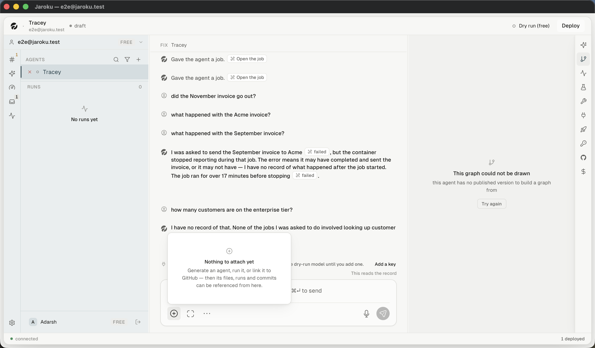

# SCREEN — Graph

| | |
|---|---|
| **Screen ID** | `RUN-02` |
| **Screen name** | Graph |
| **Route / path** | the `graph` right-panel tab |
| **Parent area** | Runs |
| **Purpose** | The agent's LangGraph, drawn, with the run's path over it |

## Empty state

> **Nothing to graph yet**
> Generate an agent and its LangGraph — nodes, edges, and the paths a run can take — is drawn here.

## Error state — observed

> **This graph could not be drawn**
> this agent has no published version to build a graph from
> `Try again`

This is a well-formed error state: a title, a cause in the product's own words, and a recovery
control. It appears for an agent that has a live deployment but no published version — see the
contradiction recorded in [`../../agents/agent-detail/SCREEN.md`](../../agents/agent-detail/SCREEN.md).

## Node accents

`GraphView`'s `KIND_ACCENT` shares its values with `tokens.ts` `ACCENT` on purpose, *"so the graph
and the plan card make one decision rather than two that happen to look alike"* — `tool` is
`ACCENT.reviewed` teal, `action` is `ACCENT.state` indigo.

## State list

| State | Screenshot |
|---|---|
| empty | `empty.png` |
| error | `error.png` |
| drawn | `IMPLEMENTED / NOT CURRENTLY OBSERVABLE` — `GraphView.tsx` (49 KB), `GraphCanvas.tsx` |
| a run's path highlighted | `IMPLEMENTED / NOT CURRENTLY OBSERVABLE` — `lib/traceGraphMap.ts` |

## Implementation references

`GraphView.tsx` (49 KB) · `GraphCanvas.tsx` · `graphIcons.tsx` + `graphIcons.test.ts` ·
`store/graphStore.ts` · `lib/graphError.ts`, `traceGraphMap.ts` · channel `graph` ·
`server/src/graphIntrospect.ts`
